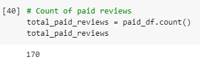
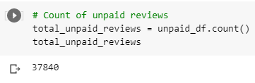
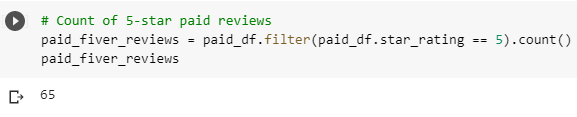
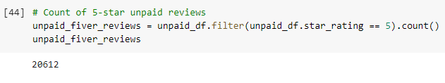
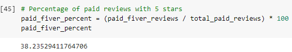
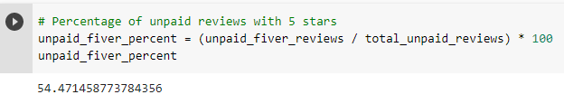

# Amazon_Vine_Analysis
## Objective
This challenge required the completion of the ETL process to load a dataset of Amazon reviews to pgAdmin in a postgreSQL schema. After completing the initial step for Deliverable 1, the challenge's primary objective was to perform an analysis on the dataset of Amazon reviews utilizing PySpark and Google Colab to investigate if there was bias in the product reviews that had been written by paid advertising partners (Vine reviews) as opposed to reviews that were written by unpaid common folk (Non-Vine reviews).   The dataset selected for this analysis was comprised of a set of reviews for pet products. To ensure the integrity of the data, only reviews with 20+ ratings with 50% or greater positive ratings were retained prior to the bias analysis. The analysis of bias is to be performed by comparing the 5-star ratings as a percent of all ratings for both paid and unpaid reviews. 

## Results
### Counts of reviews
- Count of Vine Reviews <kbd><kbd>
- Count of Non-Vine Reviews <kbd><kbd>

### Counts of 5-star reviews
- Count of 5-star Vine Reviews <kbd><kbd>
- Count of 5-star Non-Vine Reviews <kbd><kbd>

### 5-star reviews as a percentage of all reviews
- Percent of 5-star Vine Reviews <kbd><kbd>
- Percent of 5-star Non-Vine Reviews <kbd><kbd>

## Conclusions
We see that 38.24% of the Amazon Vine reviews were rated 5 stars, whereas the unpaid Amazon reviews had 54.47% rated with 5 stars. We cannot conclude that the paid advertisements had a bias towards 5-star ratings based on this information. However, because the size of the paid pool of reviews is significantly smaller than the pool of all unpaid reviews, it would be a challenge to ascertain if a paid review presented negative bias.    Future analysis should investigate the statistical distribution of all ratings, from 1- to 5-stars, between the paid and unpaid analyses to see if a pattern appears that indicates bias towards more positive ratings.
